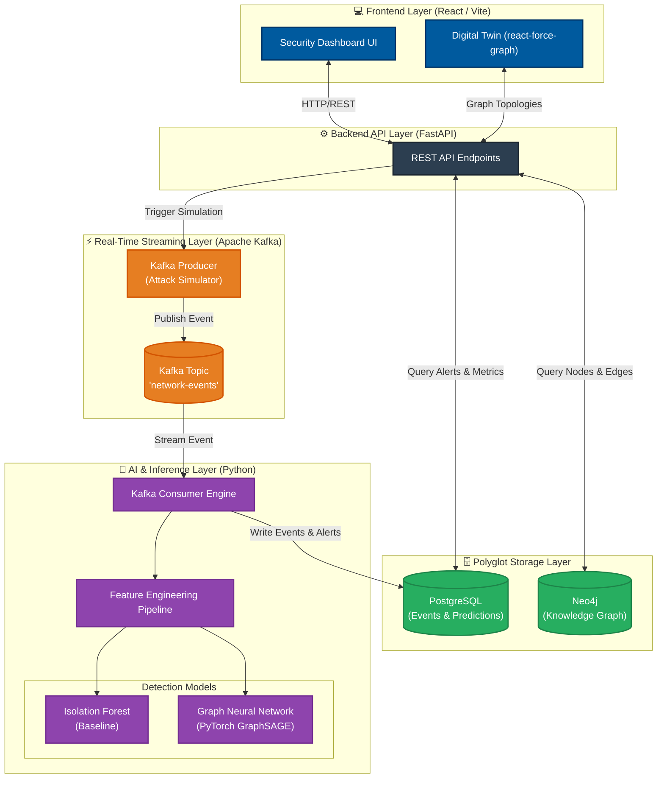

# Threat Hunting Platform - System Architecture

This diagram illustrates the end-to-end data flow and layered architecture of the platform.

### Component Breakdown:
*   **💻 Frontend Layer**: The React dashboard the operators use. It fetches real-time data from the backend.
*   **⚙️ Backend API Layer**: The FastAPI server that bridges the databases, the UI, and triggers the attack simulator.
*   **⚡ Streaming Layer**: The Kafka message broker that ensures high-throughput, fault-tolerant ingestion of network packets.
*   **🧠 AI & Inference Layer**: A continuously running Python engine that pulls from Kafka, formats the data, and runs it through the PyTorch (GNN) and Scikit-Learn (IF) models.
*   **🗄️ Storage Layer**: 
    *   **PostgreSQL**: Handles the heavy tabular data (raw event features, AI confidence scores, historical logs).
    *   **Neo4j**: Handles the complex structural relationships (which IP talked to which IP) enabling lateral movement detection.
